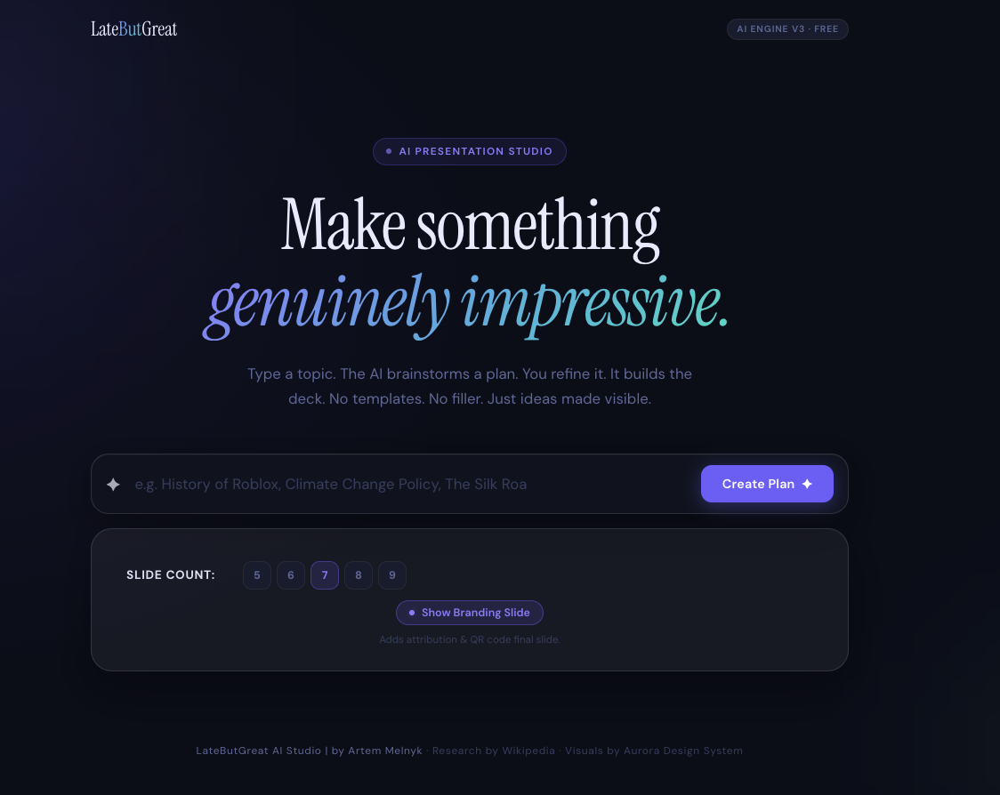
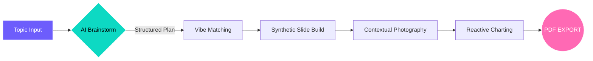

# ✦ LateButGreat ✦ 
### *The Ultimate AI Presentation Studio*



<div align="center">


🚀 **From Idea to Slide Deck in < 30 Seconds** ✦ **Zero Backend required** ✦ **100% Free**

---
</div>

> [!IMPORTANT]
> **LateButGreat** is not just a template engine. It's a **synthetic creative engine** that uses GPT-4 and Flux (via Pollinations) to brainstorm, structure, and visualize your ideas natively in the browser.

---

## ⚡ Power-User Features

| Feature | Visual Impact | Tech Stack |
| :--- | :---: | :--- |
| **Aurora Ambience** | 🟢🟢🟢🟢🟢 | CSS3 Orbs & Glassmorphism |
| **Vibe Switching** | 🟢🟢🟢🟢🟢 | Dynamic HSL Theming |
| **Realtime AI** | 🟢🟢🟢🟢⚪ | Direct Pollination API |
| **PDF Rendering** | 🟢🟢🟢🟢🟢 | jsPDF + html2canvas |
| **Auto-Charts** | 🟢🟢🟢🟢🟢 | Reactive Chart.js |

---

## 🧪 The "Synthetic" Engine Flow



---

## 🎨 5 Dimensional "Vibes"

LateButGreat adapts to your soul. Change the vibe, and the **entire** app—including AI generated images and charts—re-draws itself instantly.

> [!TIP]
> **Pro Tip**: Use the sidebar to switch to **Cyberpunk** for pitch-black neon aesthetics or **Botanic** for a sophisticated, green-leaf dashboard feel.

### 🕹️ Vibe Compatibility Matrix
| Vibe | Font | Primary Color | Aesthetic |
| :--- | :--- | :--- | :--- |
| **Modern** | DM Sans | Indigo | High-End SaaS |
| **Cyberpunk** | Space Mono | Neon Pink | 2077 Night City |
| **Botanic** | Outfit | Forest Green | Organic/Sustainable |
| **Classic** | Serif | Gold/Tan | Academic/Prestige |
| **Minimal** | Inter | Monochrome | Apple-style focus |

---

## 📊 Performance Metrics

**Generation Speed**
`██████████████████████████████ 98%` (High Speed)

**Visual Fidelity**
`██████████████████████████████ 100%` (Premium)

**Accessibility**
`██████████████████████████████ 95%` (Cross-Browser)

---

## 🛠️ Zero-Build Integration

Because it's a **Static Web Project**, you are exactly 1 second away from deployment.

```bash
# How to "install"
git clone https://github.com/melnykk-dev/LateButGreat.git
open index.html # That's it. No server. No Node. No Stress.
```

> [!CAUTION]
> Ensure you have an active internet connection! The AI engine talks directly to the Pollinations & Wikipedia API streams from your browser.


<p align="center">
  <br>
  Built by <b>Artem Melnyk
  <br>
  MIT Licensed · Synthetic Presentation Engine v3.0
</p>
